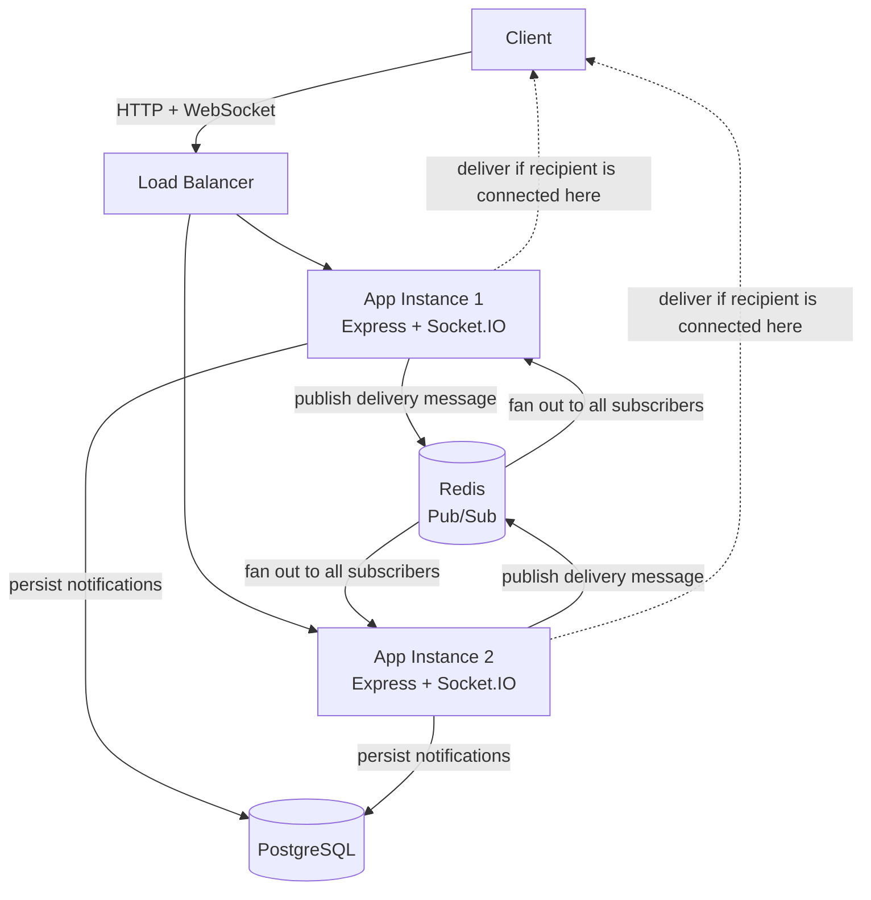

# Pulse Notification Engine


Pulse is a real-time, event-driven notification backend built to demonstrate
production-oriented backend patterns:

- REST authentication with JWTs and bcrypt
- PostgreSQL-backed notification persistence
- Event-driven notification creation with idempotency
- Socket.IO delivery to all of a user's connected devices
- Redis Pub/Sub fan-out across horizontally scaled application instances
- Request validation, rate limiting, structured logging, retries, and graceful shutdown
- Unit, integration, and WebSocket tests running in CI

## The core problem

In a horizontally scaled application, a notification may be created by one
server instance while the recipient's WebSocket is connected to another. Pulse
solves this by publishing delivery messages through Redis Pub/Sub. Every
instance receives the message and delivers it only when it owns a live socket
for the target user.

Persistence and real-time delivery are separate guarantees: the notification
is written to PostgreSQL first, while WebSocket delivery is best effort. An
offline user can retrieve the persisted notification later through the REST API.

## Table of contents

- [Architecture](#architecture)
- [Notification workflow](#notification-workflow)
- [Technology choices](#technology-choices)
- [Features](#features)
- [Getting started](#getting-started)
- [API reference](#api-reference)
- [WebSocket client](#websocket-client)
- [Event model](#event-model)
- [Database schema](#database-schema)
- [Testing and CI](#testing-and-ci)
- [Security](#security)
- [Known limitations](#known-limitations)
- [Project status](#project-status)

## Architecture



Each application instance owns its local Socket.IO connections. Redis does not
store socket connections; it distributes notification messages so that the
instance holding the recipient's socket can emit to the user's room.

## Notification workflow

```mermaid
sequenceDiagram
    participant Actor as Actor
    participant API as REST API
    participant Bus as Event Bus
    participant Consumer as Notification Consumer
    participant DB as PostgreSQL
    participant Redis as Redis Pub/Sub
    participant WS as Recipient's App Instance
    participant Recipient as Recipient

    Actor->>API: Trigger domain action
    API->>Bus: Publish typed event
    Bus->>Consumer: Consume event
    Consumer->>DB: Check notification preferences
    Consumer->>DB: Insert notification with event_id
    DB-->>Consumer: Created row or duplicate constraint error
    Consumer->>Redis: Publish notification for recipient
    Redis-->>WS: Deliver message to every app instance
    WS->>WS: Check local user room
    WS-->>Recipient: Emit notification event if connected
    Note over DB,Recipient: If offline, notification remains persisted<br/>for a later REST request
```

The notification `event_id` is unique in PostgreSQL. Reprocessing the same
event therefore does not create duplicate notifications.

## Technology choices

| Technology | Role |
|---|---|
| Express 5 | HTTP API and middleware pipeline |
| PostgreSQL 16 | Relational persistence, constraints, indexes, and JSONB metadata |
| Redis 7 | Cross-instance Pub/Sub and shared rate-limit storage |
| Socket.IO | Authenticated WebSocket transport, rooms, and reconnection support |
| JWT | Stateless authentication shared by REST and WebSocket handshakes |
| Zod | Runtime validation for request bodies, query strings, and route parameters |
| Docker Compose | Reproducible local services, including two app instances |
| Vitest | Unit, integration, and WebSocket test runner |

## Features

- Registration, login, and authenticated `/me` endpoint
- Generic authentication errors that avoid user enumeration
- Bcrypt password hashing with per-password salts
- Notification listing with bounded pagination
- Unread counts, mark-one-read, mark-all-read, and deletion
- Notification preferences with validated event types
- Per-user Socket.IO rooms for multi-device delivery
- Redis-backed rate limiting shared across app instances
- Retry/backoff handling for transient database operations
- Request IDs and structured Pino logging
- Centralized application errors and error responses
- Helmet security headers, CORS configuration, and request-size limits
- Graceful shutdown for HTTP, PostgreSQL, and Redis connections
- Development-only test-event route, disabled in production

## Getting started

### Prerequisites

- Docker Desktop with Docker Compose
- Node.js 20+ and npm, for running tests directly on the host
- Git

### 1. Configure the environment

```bash
git clone https://github.com/devanshjaincampaign-tech/pulse-notification-engine.git
cd pulse-notification-engine
cp .env.example .env
```

Update `.env` with local values. Never commit `.env`; it is gitignored.

### 2. Start the application stack

```bash
docker compose up --build -d
```

Compose starts two application instances, PostgreSQL, Redis, and a disposable
test PostgreSQL service. The application containers wait for the database and
Redis health checks before starting.

Run migrations against the development database:

```bash
docker compose exec app npm run migrate
```

Verify the API:

```bash
curl http://localhost:3000/health
```

The first app instance is available on port `3000`; the second is available on
port `3001`.

### 3. Prove cross-instance delivery

Connect a Socket.IO client to one app instance, then trigger a development test
event through the other instance. Both instances share PostgreSQL and Redis,
so the recipient receives the notification even when the event and socket are
handled by different processes.

## API reference

All protected endpoints require:

```http
Authorization: Bearer <jwt>
```

### Authentication — `/api/auth`

| Method | Endpoint | Auth | Description |
|---|---|---|---|
| POST | `/register` | No | Create a user and return user data plus a JWT |
| POST | `/login` | No | Authenticate and return user data plus a JWT |
| GET | `/me` | Yes | Return the authenticated user's identity |

Registration requires a valid email and a password of at least eight
characters. Login uses the same generic error for an unknown email and an
incorrect password.

### Notifications — `/api/notifications`

All notification routes require authentication.

| Method | Endpoint | Description |
|---|---|---|
| GET | `/?limit=20&offset=0` | Return bounded, paginated notifications |
| GET | `/unread-count` | Return the current user's unread count |
| PATCH | `/:id/read` | Mark one owned notification as read |
| PATCH | `/read-all` | Mark all notifications as read |
| DELETE | `/:id` | Delete one owned notification |

Repeatedly marking a notification as read preserves its original `read_at`
timestamp. Missing or non-owned notification IDs return a not-found response
without revealing which case occurred.

### Preferences — `/api/preferences`

All preference routes require authentication.

| Method | Endpoint | Description |
|---|---|---|
| GET | `/` | List the current user's preferences |
| PATCH | `/:type` | Update in-app and email settings for one event type |

The event type is validated against the shared event-type definition.

## WebSocket client

Provide the JWT in the Socket.IO handshake:

```js
import { io } from "socket.io-client";

const socket = io("http://localhost:3000", {
  auth: { token: "<jwt>" },
});

socket.on("notification", (notification) => {
  console.log("New notification:", notification);
});
```

The token is verified during the handshake. A successful connection joins the
room `user:<id>`, allowing one server-side emit to reach every connected device
for that user.

## Event model

The reference event is `POST_LIKED`. Events use a common envelope:

```json
{
  "eventId": "uuid",
  "eventType": "POST_LIKED",
  "timestamp": "2026-01-01T00:00:00.000Z",
  "source": "example-service",
  "actorId": "uuid",
  "targetUserId": "uuid",
  "payload": {}
}
```

`eventId` is persisted as a unique database value and is the basis for
idempotent notification creation. `USER_FOLLOWED` and `SECURITY_ALERT` are
defined event types, while `POST_LIKED` is the wired reference producer.

## Database schema

### `users`

Stores user identity and the bcrypt `password_hash`. `username` and `email`
are unique.

### `notifications`

Stores `event_id`, recipient, optional actor, type, title, message, JSONB
metadata, read state, and timestamps. `event_id` is unique. Recipient
deletion cascades to that user's notifications; deleting an actor sets
`actor_id` to null.

### `notification_preferences`

Stores per-user event-type preferences. `(user_id, notification_type)` has a
composite unique constraint and is maintained with an upsert.

The notification feed uses an index on `(recipient_id, created_at DESC)`, while
unread counts use `(recipient_id, is_read)`.

## Testing and CI

Run the test suite from the host:

```bash
npm install
docker compose up -d postgres_test redis
npm test
```

`npm test` runs migrations against the isolated `postgres_test` database before
starting Vitest. The migration runner records applied files, so repeated
sequential runs are safe. The development database is not used by the test
suite.

The suite covers:

- Unit tests with mocked repositories for service and retry logic
- Integration tests using real PostgreSQL queries and constraints
- WebSocket tests using a real Socket.IO server and client

GitHub Actions runs the same test command on pushes and pull requests using
fresh PostgreSQL and Redis service containers.

## Security

Implemented protections include:

- Bcrypt password hashing; plaintext passwords are never persisted
- JWT verification for REST and WebSocket authentication
- Generic login errors to reduce account enumeration
- Parameterized SQL queries
- Zod validation before service/database calls
- Redis-backed rate limiting on authentication endpoints
- Helmet security headers
- Configurable CORS with a production startup check
- Request body-size limits
- Centralized error handling without exposing internal error details
- Non-root application container and production image without dev dependencies
- Development-only test routes excluded from production

CSRF protection is not included because authentication uses bearer headers,
not cookies. If browser cookies are introduced later, CSRF protection must be
added before using them for authentication.

## Known limitations

- **Pub/Sub messages are not replayable.** A real-time message published while
  every relevant subscriber is unavailable is lost. PostgreSQL remains the
  source of truth; Redis Streams or another durable queue would be appropriate
  if replayable delivery were required.
- **WebSocket flood protection is separate work.** HTTP rate limiting does not
  limit repeated Socket.IO handshakes per IP.
- **JWT revocation is not implemented.** A stolen token remains usable until it
  expires; short-lived access tokens and a future refresh/revocation mechanism
  would reduce this risk.
- **Load testing is not yet performed.** Cross-instance correctness is verified
  with two local instances, but throughput and latency under concurrent load
  still need measurement.
- **Concurrent migration coordination is not implemented.** The migration
  runner is safe for sequential reruns, but production deployment should use a
  transaction and advisory lock or a single migration job.

## Project status

The core implementation is complete and verified through local and CI tests:
authentication, persistence, preferences, event-driven creation, real-time
delivery, Redis horizontal fan-out, validation, rate limiting, observability,
Docker hardening, and graceful shutdown are implemented.

The remaining work is production-scale validation and migration coordination,
not the core notification delivery path.

## License

ISC
