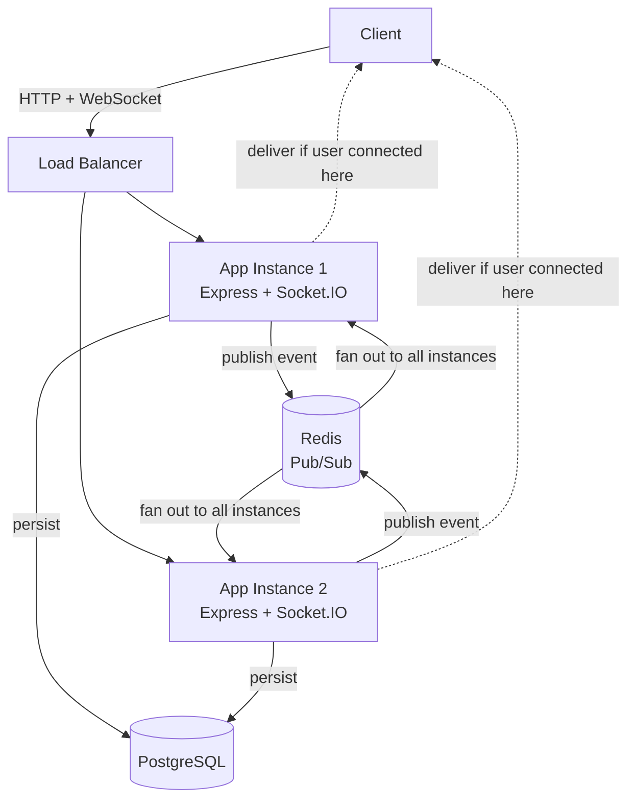
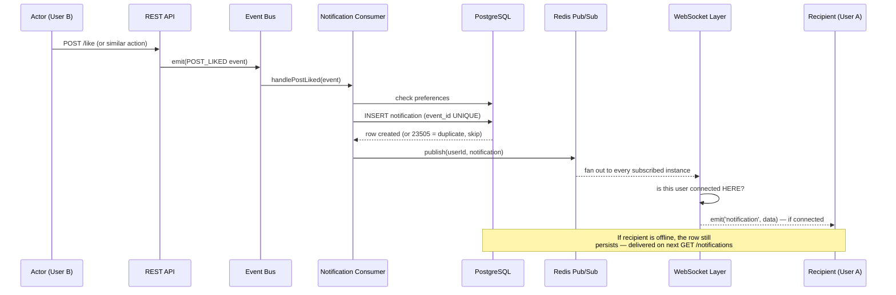

# Pulse Notification Engine

A real-time, event-driven notification backend built to explore production distributed-systems patterns: horizontal scaling of WebSocket delivery, event-driven decoupling, idempotency, and graceful degradation under failure.


**The core engineering problem this project solves:** in a horizontally-scaled backend, a notification might be *created* on one server instance while the target user is *connected* to a completely different one. This project implements and empirically proves a solution using Redis Pub/Sub — verified by running two live server instances locally and confirming cross-instance delivery actually works, not just architecturally sound on paper.

---

## Table of Contents

- [Architecture](#architecture)
- [Why These Technologies](#why-these-technologies)
- [Event Flow](#event-flow)
- [Getting Started](#getting-started)
- [API Reference](#api-reference)
- [Event Catalog](#event-catalog)
- [Database Schema](#database-schema)
- [Testing](#testing)
- [Security](#security)
- [Known Limitations](#known-limitations)
- [Project Status](#project-status)

---

## Architecture



The dotted lines are deliberate: delivery only happens on whichever instance actually holds the target user's live socket connection. Every instance receives every published event, checks its own local connections, and silently no-ops if the user isn't there — this is what makes horizontal scaling of real-time delivery work without any instance needing to know about any other.

## Why These Technologies

| Choice | Reasoning |
|---|---|
| **Express** | Minimal, unopinionated, well-understood middleware model |
| **PostgreSQL** | Relational integrity for user/notification relationships, JSONB for flexible per-type event metadata, native `UUID` and composite constraints used for idempotency |
| **Redis** | Two distinct roles: Pub/Sub for cross-instance real-time fan-out, and the mechanism that makes horizontal WebSocket scaling possible at all |
| **Socket.IO** | Reconnection handling, room-based multi-device delivery, and a clean auth hook for the handshake — all built in rather than hand-rolled |
| **JWT** | Stateless auth shared identically across REST and WebSocket handshakes |
| **Docker Compose** | Reproducible local environment: two app instances, isolated test database, Postgres, and Redis, orchestrated with health-check-aware startup ordering |

## Event Flow



Persistence and real-time delivery are deliberately independent guarantees. Persistence is unconditional; delivery is best-effort. This is proven, not assumed — see [Known Limitations](#known-limitations) for what this trade-off does and doesn't cover.

## Getting Started

### Prerequisites
- Docker Desktop

### Setup

```bash
git clone https://github.com/devanshjaincampaign-tech/pulse-notification-engine.git
cd pulse-notification-engine
cp .env.example .env    # fill in real values
docker compose up --build -d
docker compose exec app npm run migrate
```

Verify it's running:
```bash
curl http://localhost:3000/health
```

### Running two instances (proving horizontal scaling locally)

`docker compose.yml` already defines a second instance (`app2`) on port `3001`, sharing the same Postgres and Redis. Connect a WebSocket client to one instance and trigger an event via the other — delivery still works, via Redis Pub/Sub, with neither instance aware of the other's existence.

### Running tests

```bash
npm install
docker compose up -d postgres_test
node src/db/migrate.js test
npm test
```

## API Reference

### Auth — `/api/auth`

| Method | Endpoint | Auth | Rate Limited | Description |
|---|---|---|---|---|
| POST | `/register` | No | Yes (5/15min) | Create account, returns user + JWT |
| POST | `/login` | No | Yes (5/15min) | Authenticate, returns user + JWT |
| GET | `/me` | Yes | No | Returns the authenticated user's ID |

### Notifications — `/api/notifications` (all routes require auth)

| Method | Endpoint | Description |
|---|---|---|
| GET | `/?limit=20&offset=0` | Paginated notification feed |
| GET | `/unread-count` | Unread count for the current user |
| PATCH | `/:id/read` | Mark one notification read |
| PATCH | `/read-all` | Mark all notifications read |
| DELETE | `/:id` | Delete a notification |

### Preferences — `/api/preferences` (all routes require auth)

| Method | Endpoint | Description |
|---|---|---|
| GET | `/` | List current user's notification preferences |
| PATCH | `/:type` | Set `in_app_enabled` / `email_enabled` for one notification type |

### WebSocket

Connect with a JWT in the handshake `auth` payload:
```js
io('http://localhost:3000', { auth: { token: '<jwt>' } });
```
Verified once, at connection time — not re-checked per message, since the connection itself is the continuity. Each connection joins a room named `user:<id>`; every device a user has open joins the same room, so one server-side emit reaches all of them.

## Event Catalog

| Event | Actor Required | Notes |
|---|---|---|
| `POST_LIKED` | Yes | Reference implementation used throughout testing |
| `USER_FOLLOWED` | Yes | Planned shape, not yet wired to a producer |
| `SECURITY_ALERT` | No | `actor_id` is nullable specifically for system-originated events like this |

Every event follows a fixed envelope: `{ eventId, eventType, timestamp, source, actorId, targetUserId, payload }`. `eventId` is a UUID and is the actual mechanism behind idempotency — enforced by a database-level `UNIQUE` constraint, not just application logic.

## Database Schema

**`users`** — `id, username (unique), email (unique), password_hash, created_at`

**`notifications`** — `id, event_id (unique, UUID), recipient_id → users (CASCADE), actor_id → users (SET NULL, nullable), type, title, message, metadata (jsonb), is_read, created_at, read_at`
Indexes: `(recipient_id, created_at DESC)` for feed queries, `(recipient_id, is_read)` for unread counts.

**`notification_preferences`** — `id, user_id → users (CASCADE), notification_type, in_app_enabled, email_enabled, updated_at`
Composite unique constraint on `(user_id, notification_type)`, upserted via `INSERT ... ON CONFLICT`.

`recipient_id` cascades on delete (a deleted user's notifications should go with them); `actor_id` sets null instead (a deleted actor shouldn't destroy someone else's notification history).

## Testing

12 tests across 3 categories:

- **Unit** — service-layer business logic, with the repository layer mocked (`vi.mock`). Covers registration/login logic, notification ownership checks, and the full retry/backoff behavior including its idempotency bypass.
- **Integration** — real queries against an isolated `postgres_test` database (separate container, no volume, disposable by design). Never touches the real development database.
- **WebSocket** — a real Socket.IO server spun up per test file, verifying handshake authentication and rejection, using the actual `socket.io-client` library rather than mocks.

## Security

Implemented: JWT auth, bcrypt password hashing, parameterized queries throughout (no string-concatenated SQL anywhere), rate limiting on auth endpoints, Helmet security headers, CORS, request payload size limits, centralized error handling that never leaks internal error detail to clients, and generic (non-enumerating) auth error messages.

**Deliberately out of scope, and why:** CSRF protection was not implemented, because this API uses `Authorization: Bearer` header-based auth exclusively, never cookies — the attack CSRF exploits doesn't apply here.

## Known Limitations

Documented honestly, with the reasoning for each:

- **Input validation is structural, not semantic.** Postgres constraints catch *missing* required fields, but nothing currently validates that, e.g., a submitted email is actually email-shaped. A production version would add schema validation (e.g., `zod`) ahead of the service layer.
- **No WebSocket-specific connection-flood protection.** HTTP rate limiting doesn't cover the Socket.IO handshake; a malicious client could open many rapid connections. Would require custom per-IP tracking inside the socket auth middleware.
- **Redis Pub/Sub, not Streams.** If a subscriber instance is briefly down when a message publishes, that message has no replay mechanism. Acceptable for this project's scope; Redis Streams would be the correct upgrade for a system where losing an in-flight real-time message during a restart is unacceptable.
- **CORS origin must be explicitly configured before deployment.** Defaults permissively in development; the app logs an error at startup if `NODE_ENV=production` and `CORS_ORIGIN` is unset.
- **No load testing performed yet.** Horizontal delivery is proven correct with two local instances and manual triggers, not yet proven under realistic concurrent load.

## Project Status

All 11 originally-planned milestones are complete: authentication, schema design, event-driven architecture, real-time delivery, Redis-based horizontal scaling, preferences, reliability (typed errors + retry/backoff), observability (structured logging + correlation IDs), a three-tier test suite, a security pass, and production-readiness hardening (graceful shutdown, verified end-to-end).

## License

ISC