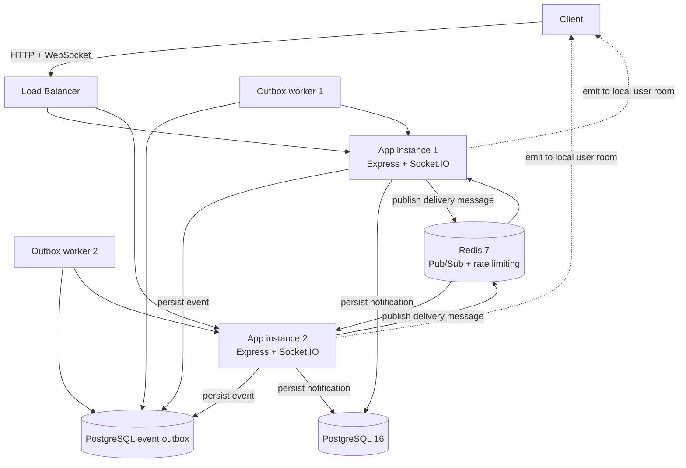
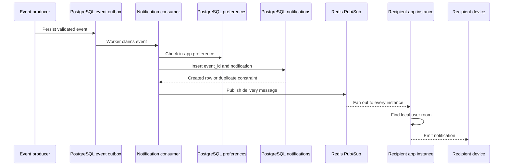

# Pulse Notification Engine


Pulse is a production-oriented, real-time notification backend built with
Node.js. It combines a REST API, PostgreSQL persistence and a durable event
outbox, Redis Pub/Sub, and authenticated Socket.IO connections.

The notification path uses a PostgreSQL-backed durable event outbox. Redis
remains the real-time delivery fan-out layer, while PostgreSQL provides the
recoverable source of truth for events waiting to be processed.

## Table of contents

- [What Pulse does](#what-pulse-does)
- [Architecture](#architecture)
- [Request and notification flows](#request-and-notification-flows)
- [Implemented capabilities](#implemented-capabilities)
- [Technology stack](#technology-stack)
- [Repository structure](#repository-structure)
- [Getting started](#getting-started)
- [Configuration](#configuration)
- [API reference](#api-reference)
- [WebSocket reference](#websocket-reference)
- [Event model](#event-model)
- [Database schema](#database-schema)
- [Testing and CI](#testing-and-ci)
- [Operational guidance](#operational-guidance)
- [Security](#security)
- [Remaining work](#remaining-work)
- [Known limitations](#known-limitations)
- [License](#license)

## What Pulse does

Pulse provides:

1. User registration and login with bcrypt password hashing.
2. Short-lived JWT access tokens and rotating, persisted refresh tokens.
3. A durable PostgreSQL notification feed and event outbox with ownership
   checks, retries, dead-letter tracking, and idempotent processing.
4. Per-user notification preferences.
5. Real-time delivery to every connected device for a user.
6. Cross-instance delivery through Redis Pub/Sub.
7. Reconnection synchronization for unread notifications.
8. Security and operational middleware such as Helmet, CORS, request IDs,
   rate limiting, request validation, structured logs, and graceful shutdown.

The persistence path is the source of truth. Socket delivery is best effort:
an offline user can still retrieve notifications through the REST API.

## Architecture



### Important delivery boundary

There are two separate delivery layers:

- **Event processing:** Producers persist validated events into the PostgreSQL
  `event_outbox` table. Workers claim rows with PostgreSQL row locks and
  `SKIP LOCKED`, process them, retry transient failures with backoff, and move
  exhausted events to `dead_letter`.
- **Delivery fan-out:** Redis Pub/Sub. Every application instance subscribes,
  checks whether the recipient has a local Socket.IO room, and emits locally.

Redis is required during startup and remains best effort for live socket
delivery. PostgreSQL protects events until the notification consumer succeeds;
an outage can still prevent an immediate WebSocket emission, but the event can
be retried by the outbox worker.

## Request and notification flows

### Authentication flow

1. The client submits credentials to `/api/auth/register` or
   `/api/auth/login`.
2. The API validates the request with Zod.
3. Passwords are hashed or compared with bcrypt.
4. The API creates a device session and returns a session-bound access token
   and refresh token.
5. The refresh token is stored as a hash in PostgreSQL and rotated
   transactionally.
6. REST and Socket.IO authentication check that the associated session remains
   active.

### Notification flow



Duplicate processing is prevented by the unique `notifications.event_id`
constraint. This is idempotency for database writes, not a guarantee that a
lost event will eventually be replayed.

## Implemented capabilities

### Authentication and identity

- `POST /api/auth/register`
- `POST /api/auth/login`
- `POST /api/auth/refresh`
- `GET /api/auth/me`
- `GET /api/auth/sessions`
- `POST /api/auth/logout` (revoke the current session)
- `POST /api/auth/logout-all`
- `DELETE /api/auth/sessions/:id` (revoke one of the current user's sessions)
- bcrypt password hashing
- generic invalid-login responses
- JWT access tokens
- seven-day, hashed refresh tokens with transactional rotation and reuse detection
- device/session records, per-device/global logout, and 30-day inactive-session cleanup
- session-bound access tokens checked against PostgreSQL on REST and WebSocket requests
- transactional user, session, and initial refresh-token creation

### Notification management

- bounded, offset-based notification listing
- unread count
- mark one notification as read
- mark all notifications as read
- delete one notification
- ownership checks so users can only access their notifications
- stable `read_at` timestamps when a notification is marked repeatedly
- unique event IDs for idempotent creation

### Preferences

- list the current user's preferences
- update in-app and email settings per event type
- validation against the shared event-type definition

### Events and real-time delivery

- `POST_LIKED` consumer and notification handler
- `USER_FOLLOWED` consumer and notification handler
- development-only test event routes
- authenticated Socket.IO handshakes
- per-IP connection and inbound-message rate limits, plus a bounded packet size
- `user:<id>` rooms for multi-device delivery
- Redis Pub/Sub fan-out between application instances
- unread notification sync on connection and reconnection

The following event types are defined but do not yet have consumers:
`COMMENT_CREATED`, `MESSAGE_RECEIVED`, `ORDER_STATUS_CHANGED`,
`PAYMENT_COMPLETED`, and `SECURITY_ALERT`.

## Technology stack

| Technology | Role |
|---|---|
| Node.js 20 | Runtime and container base |
| Express 5 | HTTP API and middleware pipeline |
| PostgreSQL 16 | Users, refresh tokens, notifications, preferences, and migrations |
| Redis 7 | Pub/Sub delivery fan-out and shared authentication rate limits |
| Socket.IO 4 | Authenticated real-time transport and user rooms |
| JWT | Short-lived access tokens bound to revocable database sessions |
| bcrypt | Password hashing |
| Zod | Runtime request validation |
| Pino | Structured application logging |
| Helmet and CORS | HTTP security and cross-origin controls |
| Docker Compose | Local multi-service development |
| Vitest | Unit, integration, and WebSocket tests |
| GitHub Actions | Continuous integration |

## Repository structure

```text
pulse-notification-system/
├── .env.example                         # Development configuration template
├── .env.test                            # Test configuration
├── .github/
│   └── workflows/
│       └── test.yml                     # PostgreSQL, Redis, and npm test CI job
├── Dockerfile                            # Non-root production image
├── docker-compose.yml                    # Two app instances plus databases/Redis
├── package.json                          # Scripts and dependencies
├── vitest.config.js                     # Node test configuration
├── src/
│   ├── app.js                           # Express app, middleware, and route mounting
│   ├── server.js                        # Startup, dependencies, WebSocket, shutdown
│   ├── config/
│   │   ├── cors.js                      # CORS policy
│   │   ├── database.js                  # PostgreSQL pool
│   │   ├── env.js                       # Environment loading and required variables
│   │   ├── logger.js                    # Pino logger
│   │   ├── metrics.js                   # Process-local Prometheus metrics
│   │   └── redis.js                     # Redis clients and connections
│   ├── common/
│   │   ├── errors/                      # Application error classes and exports
│   │   ├── middleware/                  # Error, request ID, validation, rate limiting
│   │   └── utils/                       # Retry/backoff and shared utilities
│   ├── db/
│   │   ├── migrate.js                   # Ordered SQL migration runner
│   │   └── migrations/                  # Users, notifications, preferences, outbox, sessions
│   ├── middleware/
│   │   └── auth.middleware.js            # REST JWT authentication
│   ├── events/
│   │   ├── eventPublisher.js            # Validated event persistence entry point
│   │   ├── eventTypes.js                # Shared event type constants
│   │   ├── createEvent.js               # Event envelope factory
│   │   ├── redisChannel.js              # Redis notification channel
│   │   ├── event.schema.js              # Event and producer request schemas
│   │   └── outbox/                       # Durable worker, claiming, retry, dead letter
│   │   ├── consumers/                   # Event-to-notification consumers
│   │   ├── handlers/                    # Notification builders by event type
│   │   └── producers/                   # Development test producers and routes
│   ├── modules/
│   │   ├── auth/                        # Controllers, routes, schemas, services, repositories
│   │   ├── notifications/               # Feed controller, service, repository, schemas
│   │   └── preferences/                 # Preference controller, service, repository, schemas
│   ├── websocket/
│   │   ├── index.js                     # Socket.IO setup, Redis subscription, sync
│   │   ├── socketAuth.js                # Socket JWT middleware
│   │   └── socketEmitter.js             # Local room delivery and Redis publishing
│   ├── socketAuth.js                    # Legacy/compatibility socket auth module
│   ├── utils/
│   │   ├── jwt.js                       # JWT signing and verification
│   │   └── refreshToken.js              # Refresh-token generation and hashing
│   └── testSocketClient.js              # Test/helper Socket.IO client
└── README.md                            # This project guide
```

## Getting started

### Prerequisites

- Docker Desktop with Docker Compose
- Node.js 20 or newer
- npm
- Git

### 1. Clone and configure

```bash
git clone https://github.com/devanshjaincampaign-tech/pulse-notification-engine.git
cd pulse-notification-engine
cp .env.example .env
```

On Windows PowerShell, use:

```powershell
Copy-Item .env.example .env
```

Change `JWT_SECRET`, database credentials, and `CORS_ORIGIN` before using the
service outside local development. Never commit `.env`.

### 2. Start dependencies and application instances

```bash
docker compose up --build -d
```

This starts:

| Service | Host port | Purpose |
|---|---:|---|
| `app` | 3000 | First API and Socket.IO instance |
| `app2` | 3001 | Second instance for fan-out testing |
| `postgres` | 5432 | Development database |
| `postgres_test` | 5433 | Isolated test database |
| `redis` | 6379 | Pub/Sub and rate-limit store |

Apply development migrations:

```bash
docker compose exec app npm run migrate
```

Check the API:

```bash
curl http://localhost:3000/health
```

`/ready` checks both the database and Redis; `/metrics` serves Prometheus
metrics. Keep `/metrics` private to your monitoring network in production.

Expected response:

```json
{"status":"ok"}
```

### 3. Stop local services

```bash
docker compose down
```

Add `-v` only when you intentionally want to remove the PostgreSQL volume and
all local development data:

```bash
docker compose down -v
```

## Configuration

Copy `.env.example` to `.env`. The application exits when any required
variable is missing.

| Variable | Required | Example | Description |
|---|---|---|---|
| `NODE_ENV` | No | `development` | Runtime mode; test routes are disabled in production. |
| `PORT` | Yes | `3000` | HTTP and Socket.IO port inside the container. |
| `DB_USER` | Yes | `postgres` | PostgreSQL user. |
| `DB_PASSWORD` | Yes | `changeme` | PostgreSQL password. |
| `DB_NAME` | Yes | `pulse_notifications` | Database name. |
| `DB_HOST` | Yes | `postgres` | PostgreSQL hostname. |
| `DB_PORT` | Yes | `5432` | PostgreSQL port. |
| `REDIS_HOST` | Yes | `redis` | Redis hostname. |
| `REDIS_PORT` | Yes | `6379` | Redis port. |
| `JWT_SECRET` | Yes | change-me | Secret used to sign access tokens. |
| `CORS_ORIGIN` | No | `https://app.example.com` | Allowed frontend origin in production. |
| `OUTBOX_POLL_INTERVAL_MS` | No | `1000` | Delay between durable outbox worker polls. |
| `OUTBOX_BATCH_SIZE` | No | `20` | Maximum events claimed in one poll. |
| `OUTBOX_MAX_ATTEMPTS` | No | `5` | Attempts before an event is dead-lettered. |
| `OUTBOX_RETRY_BASE_DELAY_MS` | No | `500` | Initial retry delay. |
| `OUTBOX_RETRY_MAX_DELAY_MS` | No | `30000` | Maximum retry delay. |
| `OUTBOX_LEASE_MS` | No | `60000` | Claim lease duration before a processing event can be reclaimed. |
| `WS_MAX_CONNECTIONS_PER_IP` | No | `10` | Maximum authenticated WebSocket connections per client IP. |
| `WS_MAX_HANDSHAKES_PER_MINUTE` | No | `60` | Maximum Socket.IO handshakes per client IP in a rolling minute. |
| `WS_MAX_MESSAGES_PER_MINUTE` | No | `120` | Maximum inbound Socket.IO events per IP in a rolling minute. |
| `WS_MAX_PAYLOAD_BYTES` | No | `65536` | Maximum Socket.IO packet size in bytes. |
| `WS_TRUST_PROXY` | No | `false` | Trust the first `X-Forwarded-For` address only behind a trusted proxy. |
| `METRICS_TOKEN` | Production | — | Bearer token required to expose `/metrics` in production (otherwise endpoint is hidden). |

For the test suite, `.env.test` points to the isolated test database on port
`5433` and the local Redis instance.

## API reference

All protected routes require:

```http
Authorization: Bearer <access-token>
```

Errors use the centralized application error format and include a request ID
in logs for correlation.

### Authentication — `/api/auth`

| Method | Endpoint | Auth | Description |
|---|---|---|---|
| `POST` | `/register` | No | Create a user and return user, access token, and refresh token. |
| `POST` | `/login` | No | Authenticate and return user, access token, and refresh token. |
| `POST` | `/refresh` | No | Rotate a valid refresh token and return replacement tokens. |
| `GET` | `/me` | Yes | Return the authenticated user's identity. |
| `GET` | `/sessions` | Yes | List the authenticated user's active devices/sessions. |
| `POST` | `/logout` | Yes | Revoke the session used by this access token. |
| `POST` | `/logout-all` | Yes | Revoke every active session for the authenticated user. |
| `DELETE` | `/sessions/:id` | Yes | Revoke one owned session by UUID. |

Registration requires a valid email and a password of at least eight
characters. Login intentionally uses the same error for an unknown email and
an incorrect password.
Login optionally accepts a `deviceName` (up to 100 characters); user-agent and
remote IP metadata are captured from the request. Sessions are revoked
immediately for subsequent REST and WebSocket handshakes. Already established
WebSocket connections are disconnected across instances through Redis when a
session is revoked. The session list includes a `current` flag for the token's
own session. Reusing a refresh token that has already been rotated revokes its
session. Expired/revoked session records are cleaned up after 30 days.

Example:

```bash
curl -X POST http://localhost:3000/api/auth/register \
  -H "Content-Type: application/json" \
  -d '{"username":"alice","email":"alice@example.com","password":"password123"}'
```

### Notifications — `/api/notifications`

All notification routes require authentication.

| Method | Endpoint | Description |
|---|---|---|
| `GET` | `/?limit=20&offset=0` | Return bounded, paginated notifications. |
| `GET` | `/unread-count` | Return the current user's unread count. |
| `PATCH` | `/:id/read` | Mark one owned notification as read. |
| `PATCH` | `/read-all` | Mark all notifications as read. |
| `DELETE` | `/:id` | Delete one owned notification. |

Missing or non-owned IDs return a not-found response without revealing which
case occurred.

### Preferences — `/api/preferences`

All preference routes require authentication.

| Method | Endpoint | Description |
|---|---|---|
| `GET` | `/` | List the current user's preferences. |
| `PATCH` | `/:type` | Update in-app and email settings for one event type. |

The event type is checked against the shared event-type definition.

### Development test events — `/api/test-events`

These routes are mounted only when `NODE_ENV` is not `production`. They are
intended for local demonstrations, not external producer traffic.

| Method | Endpoint | Description |
|---|---|---|
| `POST` | `/post-liked` | Emit a `POST_LIKED` event. |
| `POST` | `/user-followed` | Emit a `USER_FOLLOWED` event. |

Both routes require authentication and validate request bodies with Zod.
Events are persisted to the PostgreSQL outbox before the route responds.

## WebSocket reference

Connect with a JWT in the Socket.IO handshake:

```js
import { io } from "socket.io-client";

const socket = io("http://localhost:3000", {
  auth: { token: "<access-token>" },
});

socket.on("sync", ({ notifications }) => {
  console.log("Unread notifications:", notifications);
});

socket.on("notification", (notification) => {
  console.log("New notification:", notification);
});
```

On connection, the server:

1. verifies the JWT and checks that its session is active;
2. enforces per-IP handshake and active-connection limits;
3. joins the socket to `user:<id>` and, for session-bound tokens, `session:<id>`;
4. queries up to 50 unread notifications directly from PostgreSQL;
5. emits those unread notifications in a `sync` event.

Every device for the same user joins the same room. A notification published
by any instance is delivered to all local instances through Redis, and each
instance emits only if it owns a connection for that user. Inbound socket
events are rate-limited by IP and oversized packets are rejected. These IP
counters are in-memory and apply per app instance.

## Event model

Events are created with this envelope:

```json
{
  "eventId": "uuid",
  "eventType": "POST_LIKED",
  "timestamp": "2026-01-01T00:00:00.000Z",
  "source": "example-service",
  "actorId": 17,
  "targetUserId": 42,
  "payload": {}
}
```

Defined event types:

| Event type | Consumer | Current status |
|---|---|---|
| `POST_LIKED` | Yes | Wired to notification creation and delivery |
| `USER_FOLLOWED` | Yes | Wired to notification creation and delivery |
| `COMMENT_CREATED` | No | Constant only |
| `MESSAGE_RECEIVED` | No | Constant only |
| `ORDER_STATUS_CHANGED` | No | Constant only |
| `PAYMENT_COMPLETED` | No | Constant only |
| `SECURITY_ALERT` | No | Constant only |

`eventId` is generated with `randomUUID()` and stored as a unique database
value. A duplicate event is ignored by the outbox insert and by notification
creation. Event envelopes and development producer bodies are validated with
Zod before persistence.

## Database schema

Migrations are applied in filename order:

### `users`

Stores usernames, unique email addresses, bcrypt password hashes, and
timestamps.

### `notifications`

Stores the unique `event_id`, recipient, optional actor, event type, title,
message, JSONB metadata, read state, and timestamps. Recipient deletion
cascades to notifications; deleting an actor sets `actor_id` to null.

### `notification_preferences`

Stores per-user in-app and email settings. The pair
`(user_id, notification_type)` is unique and maintained with an upsert.

### `refresh_tokens`

Stores hashed refresh tokens, owning users, expiration, revocation state, and
timestamps. Raw refresh tokens are returned to clients but are not persisted.
Each token belongs to a `user_sessions` record and points to its replacement
after rotation; presenting an already-rotated token revokes its entire session.

### `user_sessions`

Stores the device label, user agent, IP address, creation/last-use/expiry times,
and revocation state for each authenticated device. `GET /api/auth/sessions`
only returns active sessions. Expired or revoked session records are purged
after 30 days; their refresh-token history is retained during that period for
reuse detection.

## Health, metrics, and correlation

- `GET /health` is a liveness check and does not depend on backing services.
- `GET /ready` checks PostgreSQL and Redis and returns HTTP 503 if either is
  unavailable.
- `GET /metrics` exposes Prometheus text metrics for HTTP request counts and
  latency, outbox row counts by state and processing outcomes/duration/age,
  notification creation and Pub/Sub delivery outcomes/latency, WebSocket
  connections, and unread sync size/time.
- `/metrics` is hidden in production unless `METRICS_TOKEN` is configured; when
  enabled it requires `Authorization: Bearer <token>`.
- HTTP request IDs are returned as `X-Request-ID` and included in structured
  request logs; event IDs are included in outbox and notification logs for
  cross-component correlation. This is lightweight log correlation, not an
  OpenTelemetry exporter or distributed span backend.

`WS_MAX_CONNECTIONS_PER_IP`, `WS_MAX_MESSAGES_PER_MINUTE`, and
`WS_MAX_PAYLOAD_BYTES` configure WebSocket limits. `WS_TRUST_PROXY` defaults
to false; enable it only behind a trusted proxy that overwrites
`X-Forwarded-For`. These in-memory IP limits apply per app instance, not
globally across the load-balanced deployment.

Important indexes include the notification feed index on
`(recipient_id, created_at DESC)` and the unread-count index on
`(recipient_id, is_read)`.

## Testing and CI

### Run tests locally

Start the test dependencies:

```bash
docker compose up -d postgres_test redis
```

Then run:

```bash
npm install
npm test
```

`npm test` applies test migrations and runs Vitest. The test suite requires a
reachable PostgreSQL instance on `localhost:5433` and Redis on
`localhost:6379`; without those services, migration startup fails before
Vitest begins.

Useful scripts:

| Command | Purpose |
|---|---|
| `npm run start` | Start the server |
| `npm run dev` | Start with Nodemon |
| `npm run migrate` | Apply development migrations |
| `npm run migrate:test` | Apply test migrations |
| `npm test` | Migrate the test database and run Vitest |

### What is tested

- retry and backoff behavior
- authentication service behavior
- notification service behavior
- PostgreSQL repository behavior and constraints
- Socket.IO authentication and delivery behavior

GitHub Actions runs the test job on pushes and pull requests to `main` with
fresh PostgreSQL and Redis service containers.

## Operational guidance

### Local scaling demonstration

Run both application services:

```bash
docker compose up --build -d app app2 postgres redis
```

Connect a client to port `3000`, then call a test-event endpoint on port
`3001` with the same user's access token. Redis should fan the delivery
message across both instances, allowing the socket connected to port `3000` to
receive it.

### Shutdown behavior

The server handles `SIGTERM` and `SIGINT`, closes the HTTP server, PostgreSQL
pool, and Redis clients, and forces exit after a ten-second timeout.

### Logging

Pino emits structured logs for requests, authentication-relevant operations,
notification creation, connection lifecycle, failures, and shutdown. Request
IDs are attached to incoming requests for correlation.

## Security

Implemented baseline protections:

- bcrypt password hashing
- JWT verification for REST and WebSocket authentication
- hashed refresh-token persistence
- transactional refresh rotation, replay-triggered session revocation, and
  per-device/global logout
- immediate access-token revocation through session checks (legacy access
  tokens without a session claim remain valid only until their short expiry)
- generic login errors to reduce account enumeration
- parameterized SQL queries
- Zod validation on supported API schemas
- Redis-backed authentication rate limiting
- Helmet security headers
- configurable CORS with production checks
- ten-kilobyte JSON request limit
- centralized errors without internal-error details in responses
- non-root application container
- production container installation without development dependencies
- development test routes excluded from production
- WebSocket per-IP handshake/connection/message limits, packet-size bounds, and safe
  validation of untrusted Redis Pub/Sub payloads

Bearer headers are used instead of authentication cookies, so CSRF protection
is not currently required. If browser cookies are introduced, add CSRF
protection before using them for authentication.

## Remaining work

The P0 reliability and P1 security/operations work is implemented. Remaining
work is now primarily product expansion, distributed observability, and
production operations.

### Reliability follow-ups

- Add an administrative workflow to inspect and replay dead-letter events.
- Configure alert rules for pending, processing, and dead-letter outbox
  thresholds, as well as notification and WebSocket failures.
- Consider a separate worker deployment when API and event-processing scaling
  requirements diverge.

### Security and operations

Implemented P1 security and operations capabilities include transactional
refresh rotation, session listing and revocation, session cleanup and replay
detection, session-bound access-token checks, WebSocket handshake/connection/
message limits, Redis Pub/Sub validation, liveness/readiness endpoints, and
Prometheus metrics. Metrics and WebSocket IP limits are process-local; configure
scraping and alerting separately. Legacy access tokens without a session claim
remain valid until their short expiry.

### P2 — Product completeness

- Implement handlers and tests for `SECURITY_ALERT`,
  `COMMENT_CREATED`, `MESSAGE_RECEIVED`, `ORDER_STATUS_CHANGED`, and
  `PAYMENT_COMPLETED`, or remove unsupported constants.
- Add email or other out-of-band notification delivery if the `email_enabled`
  preference is intended to have behavior.
- Add cursor pagination for large notification feeds.
- Add API/OpenAPI documentation and contract tests.
- Add production deployment manifests, secret management, backups, and
  rollback guidance.
- Run and document repeatable load, failure-injection, and multi-instance
  chaos tests.

## Known limitations

- Redis Pub/Sub is not replayable.
- Notification delivery is best effort after database persistence.
- Redis is required for startup and authentication rate limiting.
- Connection sync returns up to 50 unread notifications.
- Metrics and WebSocket IP limits are per-process, not shared across instances.
- There is no OpenTelemetry exporter or distributed tracing backend.
- There is no built-in email sender despite storing email preferences.
- Load and chaos testing are not part of the repository's automated CI job.

## License

ISC
